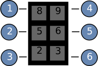

<h3>Азбука Брайля</h3>
Приложение предназначено для незрячих или плохо-видящих людей и их близких, которое построено с использованием тактильного и клавишного шрифта.

Программа написана для Персонального Компьютера на **WPF** и на Android - **Xamarin** (находится в тестовом режиме).

Приложение имеет 6 ячеек, одинаково разделённых по экрану, где каждая пронумерована согласно стандартному Алфавиту <strong>Брайля.</strong>

Разделите своё устройство на 6 равных частей и используйте по назначению.
Приложение имеет русскую и английскую раскладку, а также добавление цифр и символов.

**Русская раскладка (по умолчанию):**
Нажатие на кнопку **«2»** (на клавиатуре – **5**) один раз и на **«5»** (на клавиатуре – **6**) два раза.
**Английская раскладка:** Нажатие на кнопку **«2»** один раз и на **«5»** три раза.
**Цифры:** Нажатие на кнопку **«2»** два раза и на **«5»** два раза.
**Символы:** Нажатие на кнопку **«2»** один раз и на **«5»** два раза.

Для ввода пробела нажмите кнопку **«6»** 2 раза или на клавиатуре клавиша **«Пробел».**

**Работа в программе.**
При запуске издаётся **звуковой сигнал**, который свидетельствует о начале работы и о начале старта Таймера, который длится 6 секунд

После звукового сигнала нажимайте ячейки/клавиши клавиатуры согласно Алфавиту Брайля. Звуковой сигнал сообщает о новой итерации введения букв/цифр.
    
При каждой итерации буквы и символы складываются в слова/текст. После нажатии больше трёх раз на кнопку **1** - открывается Новое окно с результатом Итогового Текста и сохраняется в Файл, находящийся
в папке (смотри **Сборка. Пункт 4**).

При вводе с клавиатуры:
- Точка **1** – клавиша **8**;
- Точка **2** – клавиша **5**;
- Точка **3** – клавиша **2**;
- Точка **4** – клавиша **9**;
- Точка **5** – клавиша **6**:
- Точка **6** – клавиша **3**.

**Сборка:**

1. Клонируйте Репозиторий или скачайте ZIP-файл.
2. В папке найдите и откройте .sln файл.
3. Соберите. В Visual Studio - комбинация клавиш: **Ctrl + Shift + B** .
4. В папке **\bin\Debug\net6.0-windows** появится **.exe** Приложение.
5. **Запустите.**